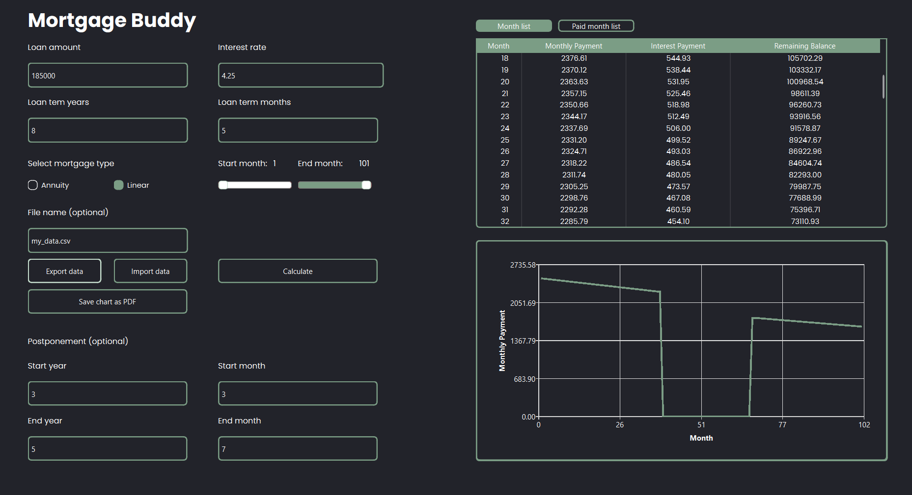
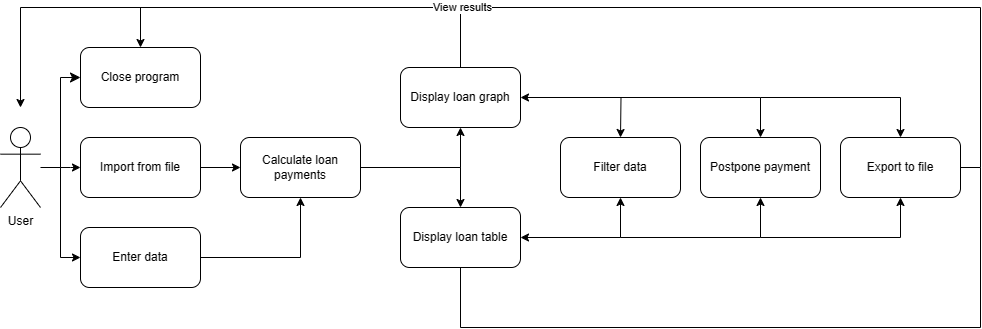
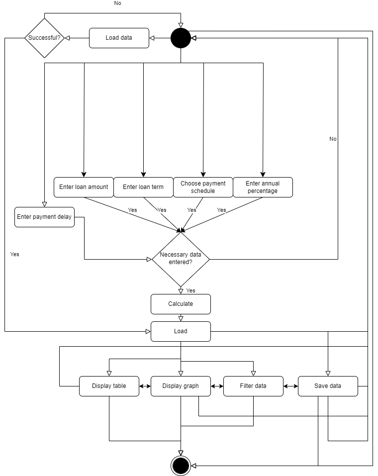

# _Your Mortgage Buddy_

## Team Name
**CashFlow Calculators**
## Project members 
Julius Jauga `Team Lead` `Developer`

Aurelijus Lukšas `Tester` `Developer`

Rokas Baliutavičius `Designer` `Developer`

## Project description
Your Mortgage Buddy is a user friendly application designed to help you calculate your loan payments without you having to pay for it! How great is that? Our application aims to simplify the process of calculating your monthly mortgage payments based on loan amount, interest rate, loan term and the payment postponements.
With "Your Mortgage Buddy", users can input their loan details and receive calculations of their mortgage payments instantly. They can see graphs of their desired payment schedule while also being able to filter the months of payment. These calculations can also be saved to a file or loaded from it.
## Project structure
The application will be composed of these main components:
- **`Main application`**
- **`Controller class`**
- **`CSVStream class`**
- **`MonthData class`**
- **`Calculations class`**
- **`customQTextEdit`**
- **`ListCreationStrategy`**

All of these components will work to build the application. The main application will be the runner of Your Mortgage Buddy, Controller class will control user input and display the output, CSVStream class will be responsible for saving and loading loan information, MonthData class will hold payment information for a specific month and Calculations class with ListCreationStrategy class will be responsible for the calculations of the desired payment schedule while also being able to handle calculations if postponement is added. A customQTextEdit class was added to make user input more friendly.
## Use case diagram

## Activity case diagram

## Technologies
- Qt library and tools for C++
- Doxygen
- TexLive
## Documentation
Latest documentation file version can be found [here](Documentation_2024-05-20.pdf).
## To-do
- [x] Add main logic to calculate monthly payments.
- [x] Add a way to take user input.
- [x] Add table and graph output to the UI.
- [x] Ability to export and import data to and from CSV files.
- [x] Ability to choose export and import file name.
- [x] Add design to the UI.
- [x] Add safeguards for user input.
- [x] Add documentation.
## Report
The table below will contain information about the work and time spent on this project.
| Julius Jauga | Aurelijus Lukšas | Rokas Baliutavičius |
|------ | ------ | ------ | 
| README.MD writing, activity case diagram  __2 h 30 min__ (**P1**)| Use case diagram __1 hour__ (**P1**)|Proofreading, use case diagram  __45 minutes__ (**P1**) |
| Added a Qt project to the repository. Implemented basic functionality to the GUI, including layout setup and basic input checking. Created a MonthInfo class to represent monthly payment information. Implemented a Calculations class responsible for generating lists for month information. __5 h__ (**P2**) | Added ability to filter the list and graph by a time interval. Created classes for strategy design patern and implemented their usage in to the code. __3 h 30 min__ (**P2**) | Added a line graph for displaying monthly payments and ability to export said graph to PDF. __2 h 30 min__ (**P2**) | 
| Documentation writing, implemented tabs and a feature to be able to add paid months to a list and view that list. Safeguarded from duplicate months, months get sorted. Generated Doxygen documentation in PDF format. __3 h__ (**P3**) |Implemented safeguards, added data importing and exporting from CSV files, improved filtering controls. __4 h 30 min__ (**P3**) | Added styling for the UI, fixed movement between input fields,. __6 h 30 min__ (**P3**) |

**Grade will be shared equally between members.**

__2024-04-01__ __FINISHED__ Calculations class needs testing and fixing. Input checking should be improved. GUI layout will have to be remade.
__2024-05-20__ __FINISHED__ Documentations, bug fixes, features, project finished.
